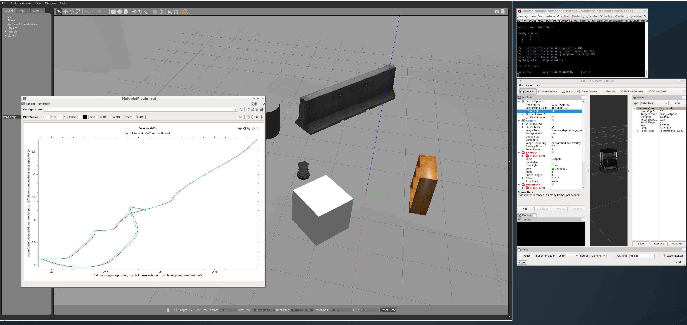

[](https://www.udacity.com/robotics)

# RoboND_Kalman-Filter
Lab for Robotics Software Engineer "Kalman Filter"

### Steps to launch the simulation

#### Step 1 Update and upgrade the Workspace image
```sh
$ sudo apt-get update
$ sudo apt-get upgrade -y
```

#### Step 2 Clone the lab folder in /home/workspace/
```sh
$ cd /home/workspace/
$ git clone https://github.com/tobiassteidle/RoboND_Kalman-Filter.git
```

#### Step 3 Compile the code
```sh
$ cd /home/workspace/RoboND_Kalman-Filter/catkin_ws
$ catkin_make
```

#### Step 4 Source ROS in this workspace
```sh
$ source devel/setup.bash
```

#### Step 5 Run the Simulation  
```sh
$ roslaunch my_robot world.launch
$ roslaunch ball_chaser ball_chaser.launch
```

### Output

[](https://www.udacity.com/robotics)

# RoboND_P2_Go-Chase-It
Robotics Software Engineer Project "Go Chase It!"

### Steps to launch the simulation

#### Step 1 Update and upgrade the Workspace image
```sh
$ sudo apt-get update
$ sudo apt-get upgrade -y
```

#### Step 2 Clone the lab folder in /home/workspace/
```sh
$ cd /home/workspace/
$ git clone https://github.com/tobiassteidle/RoboND_P2_Go-Chase-It
```

#### Step 3 Compile the code
```sh
$ cd /home/workspace/RoboND_P2_Go-Chase-It/catkin_ws
$ catkin_make
```

#### Step 4 Source ROS in this workspace
```sh
$ source devel/setup.bash
```

#### Step 5 Run the Simulation  
```sh
$ roslaunch my_robot world.launch
$ roslaunch ball_chaser ball_chaser.launch
```

### Output

